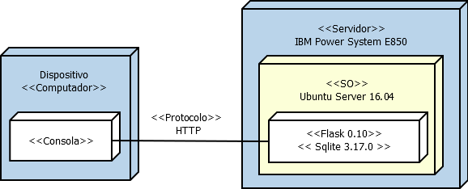

## Miniproyecto Sistemas Operativos

**Universidad ICESI**  
**Curso:** Sistemas Operativos  
**Docente:** Daniel Barragán C.  
**Tema:**  Servicios web  
**Correo:** daniel.barragan at correo.icesi.edu.co
**Estudiantes:** Nicolas Recalde / Alejandro Bueno / Ruben Ceballos

## Objetivos
* Desplegar una aplicación en un servidor que ejecuta el sistema operativo Linux
* Realizar los ajustes y depuración necesarios para desplegar una
aplicación en Linux
* Realizar aplicaciones para obtener información del sistema operativo

## Descripción
Para el despliegue de una aplicación en un servidor se requiere conocer los procedimientos necesarios relacionados con la configuracion de las interfaces de red, ajustes de seguridad, instalación de dependencias, usuarios y herramientas de depuracíon del sistema operativo.

El siguiente proyecto consiste en el despliegue de una aplicación web para obtener información del sistema operativo (La aplicación debe permitir consulta uso de CPU, memoria y espacio en disco). Para este propósito se debe emplear el sistema operativo Ubuntu Server 16.04, el microframework flask y ambientes virtuales.

<p align="center">
  
</p>

## Desarrollo

Para el desarrollo de este proyecto se instaló y se trabajó sobre una máquina virtual UbuntuServer 16.04  
![][1]  
**El proceso fue el siguiente:**  
**1.Configuración de las interfaces de red**  
Una para LocalHost y otra para Adaptador Puente:  
![][2]  
**2. Configuración de puertos**  
Abrimos el puerto 5000 por el cual se configurará el servicio  
![][3]  
**3. Configuración de otras dependencias**
Iniciamos el servicio de SSH  
![][4]  
Cabe aclarar que lo habilitamos en caso de trabajar de manera remota, pero en este proyecto todo se hizo desde la misma máquina virtual  
Ahora debemos instalar pip. Para esto ejecutamos los siguientes comandos:  
```
 sudo apt-get update
 sudo apt-get -y upgrade
```  
Verificamos que Python3 haya sido instalado e instalamos pip:  
```
 python3 -V
 sudo apt-get install -y python3-pip
```
**4. Creación de ambientes virtuales**  
Ahora procedemos a la creación de un ambiente virtual:  
```
 sudo pip3 install virtualenv 
 virtualenv proyecto
 source proyecto/bin/activate 
```  
![][5]  
Ahora vamos al ambiente e instalamos Flask  
```
 source proyecto/bin/activate 
 pip install flask
```  
![][6]  
**5. Aplicación en Python**  
Se requiere realizar una apliación en Python para obtener la información del sistema operativo (La aplicación debe permitir consulta uso de CPU, memoria y espacio en disco). Así que se hizo lo siguiente:  
![][7]


## Referencias
* https://www.digitalocean.com/community/tutorials/how-to-install-python-3-and-set-up-a-local-programming-environment-on-ubuntu-16-04  
* https://www.digitalocean.com/community/tutorials/how-to-set-up-a-firewall-with-ufw-on-ubuntu-16-04  
* https://stackoverflow.com/questions/19267591/how-to-store-os-system-output-in-a-variable-or-a-list-in-python  

[1]: images/ubuntuServer.JPG
[2]: images/conftarjetared.JPG
[3]: images/firewallport.JPG
[4]: images/sshstart.JPG
[5]: images/virtualenv.JPG
[6]: images/installflask.JPG
[7]: images/service.JPG
